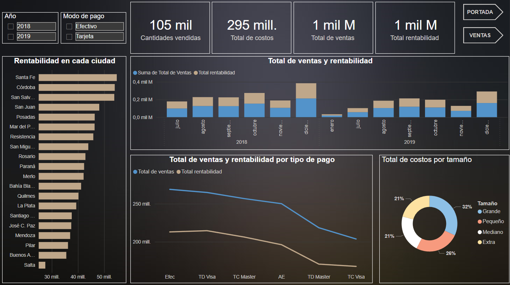
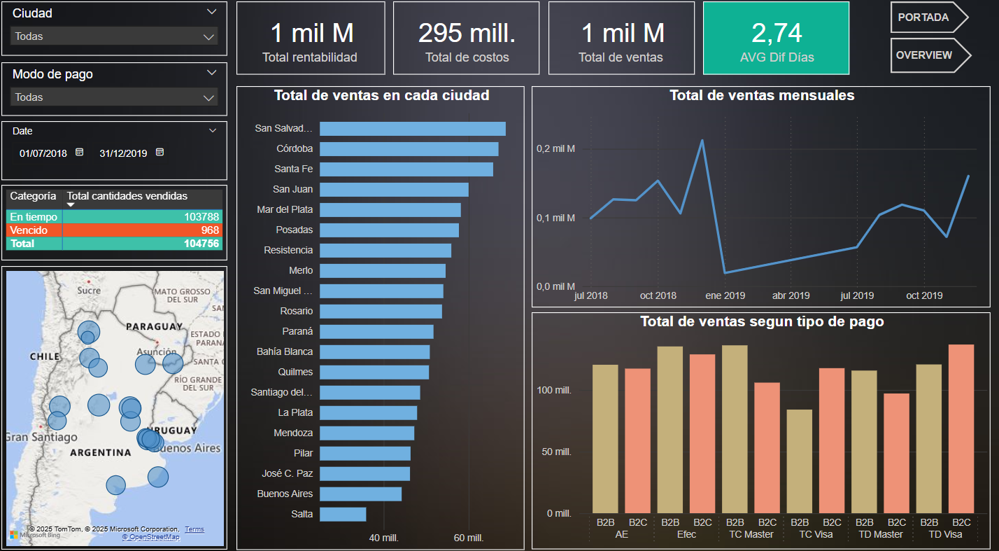

# 📊 Proyecto Final Power BI – Coderhouse  

Este repositorio contiene el **dashboard final desarrollado en Power BI** como parte del curso **Power BI** en [Coderhouse](https://www.coderhouse.com/).  
El trabajo incluye visualizaciones interactivas para analizar ventas, costos, rentabilidad y distribución geográfica de los datos.  

---

## 📝 Descripción del curso  
El curso **Power BI** de Coderhouse tuvo una duración de **5 semanas (18 horas)** y me permitió:  

- Dominar el proceso de **conexión y modelado de datos** en Power BI.  
- Construir dashboards interactivos con **DAX, medidas, segmentadores y filtros**.  
- Desarrollar **visualizaciones claras y enfocadas en el negocio**.  
- Aplicar buenas prácticas de **storytelling con datos**.  

📜 **Certificado obtenido:**  
- [Ver certificado](Certificado/Certificado%20de%20Power%20BI.png)  
- Fecha: 15 de diciembre de 2022  
- Destacado: **Top 10 de estudiantes**  

---

## 📈 Dashboard – Insights principales  

El dashboard se organiza en diferentes vistas para analizar **ventas y rentabilidad** según ciudad, periodo y medio de pago.  

### 🔹 1. Portada  
  

Pantalla inicial del dashboard que permite navegar entre las diferentes secciones (**Overview** y **Ventas**).  

---

## 🚀 Tecnologías utilizadas  

- **Power BI Desktop**  
- **Lenguaje DAX** para medidas y KPIs  
- **Mapas y visualizaciones interactivas**  
- **GitHub** para versionado y publicación del proyecto  

---

### 🔹 2. Overview  
  

- **Indicadores clave (KPI):**  
  - 105 mil unidades vendidas.  
  - 295 millones en costos.  
  - 1 mil millones en ventas totales.  
  - 1 mil millones en rentabilidad.  

- **Rentabilidad por ciudad:**  
  - Las ciudades con mayor rentabilidad son **Santa Fe, Córdoba y San Salvador**.  
  - En contraste, **Buenos Aires y Salta** muestran menor contribución.  

- **Ventas mensuales:**  
  - Se observa un **pico en diciembre** (época de mayor consumo).  
  - La tendencia en 2019 es más estable respecto a 2018.  

- **Medios de pago:**  
  - El efectivo representa el mayor volumen de ventas, aunque la **rentabilidad se mantiene más equilibrada entre tarjetas y efectivo**.  

- **Costos por tamaño de producto:**  
  - Mayor proporción en productos **grandes (32%)**, seguidos por medianos y pequeños.  

---

### 🔹 3. Ventas  
  

- **Total de ventas por ciudad:**  
  - El top 3 está liderado por **San Salvador, Córdoba y Santa Fe**.  
  - Las ventas más bajas se concentran en **Buenos Aires y Salta**.  

- **Categoría de pedidos:**  
  - El **99% de las entregas se realizaron en tiempo**, lo que refleja **eficiencia operativa**.  

- **Ventas mensuales:**  
  - Importante **pico en enero 2019**, probablemente asociado a campañas de temporada.  

- **Tipo de pago y cliente:**  
  - Se diferencian ventas **B2B y B2C**, mostrando que las **ventas a clientes finales (B2C)** son las más relevantes en tarjetas de crédito.  

- **Mapa geográfico:**  
  - Concentración de ventas en el **centro y litoral argentino**.  

---

## 📂 Estructura del repositorio  

```
├── Certificado
│   └── Certificado de Power BI.png
├── Dashboard
│   ├── Overview.png
│   ├── Ventas.png
│   ├── portada.png
│   └── Dashboard-Coderhouse.pdf
└── README.md
```

---

## 📌 Conclusiones  

- El dashboard permite un análisis integral de **ventas, rentabilidad y costos**.  
- Las ciudades con mejor desempeño se concentran en **Santa Fe y Córdoba**, mientras que Buenos Aires queda rezagada.  
- La **estacionalidad** juega un papel importante (ventas altas en diciembre y enero).  
- Los **productos grandes** generan la mayor proporción de costos.  
- La eficiencia en la entrega es un punto fuerte: casi todas las órdenes se cumplen **en tiempo**.  

---

✒️ **Autor:** Federico Lami  
📧 Contacto: [LinkedIn](https://www.linkedin.com/in/federicolami/)  
